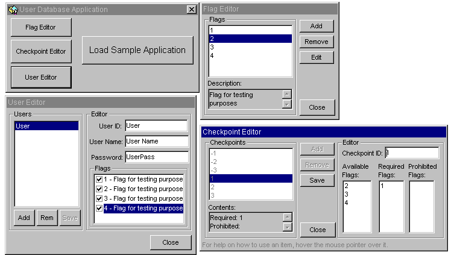



## Application Login System \(With Multiple Customizable Users/Flags/Checkpoints\)

### Description

This code creates and maintains a database of multiple users that may use your program. This supports user flags that YOU specify and define as well as a checkpoint system that YOU build! Documentation and sample projects included.
 
### More Info
 

             |
---                |---
**Submitted On**   |2001-05-13 18:20:42
**By**             |[Tim Feeley](https://github.com/Planet-Source-Code/PSCIndex/blob/master/ByAuthor/tim-feeley.md)
**Level**          |Intermediate
**User Rating**    |3.7 (26 globes from 7 users)
**Compatibility**  |VB 6\.0
**Category**       |[Databases/ Data Access/ DAO/ ADO](https://github.com/Planet-Source-Code/PSCIndex/blob/master/ByCategory/databases-data-access-dao-ado__1-6.md)
**World**          |[Visual Basic](https://github.com/Planet-Source-Code/PSCIndex/blob/master/ByWorld/visual-basic.md)
**Archive File**   |[Applicatio195935132001\.zip](https://github.com/Planet-Source-Code/tim-feeley-application-login-system-with-multiple-customizable-users-flags-checkpoints__1-23167/archive/master.zip)

